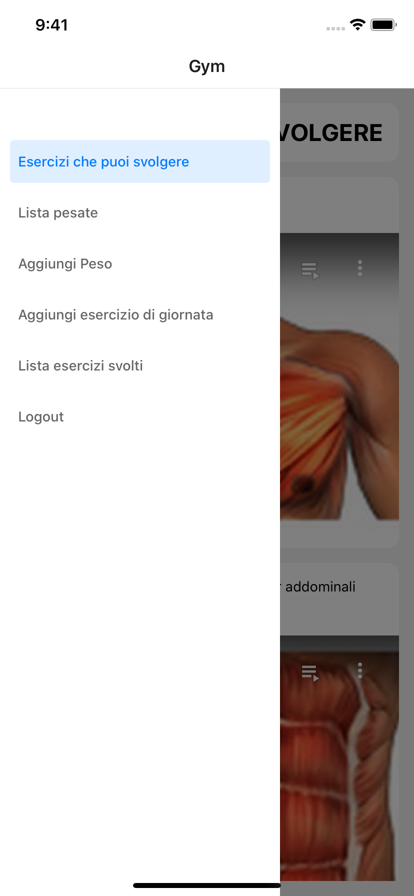

# ReactNativeApp
[](https://reactnative.dev/)
[](https://developer.mozilla.org/en-US/docs/Web/Guide/HTML/HTML5)
[](https://www.typescriptlang.org/)
[](https://developer.apple.com/ios/)
[](https://developer.android.com/)
[](https://firebase.google.com/)
[](https://github.com/inProgress-team/react-native-youtube)
[](https://redux.js.org/)


## Gym
React Native Project - Gym Accademic project
## Description

The goal was to manage the exercises for a particular user with memo and Youtube Playlist. The exercises are stored in firebase.
Function:
- Add/Remove all weights with specific date
- Add/Remove exercises with specific date
- View Youtube Playlist
## Topics
* React Native
* Firebase
* React Native Youtube
* Redux

## Setup
To run this project, install it locally using npm:
IOS:
> Before must be set the token of Firebase on the specific file: src/firebase/config.js .
> Add the configuration for api key and ecc .

```
$ npm install
$ npx pod-install
$ npx react-native run-ios

```


## Images
Login   

Playlist Youtube

Menu

Add Exercise

List Exercise

Logout


